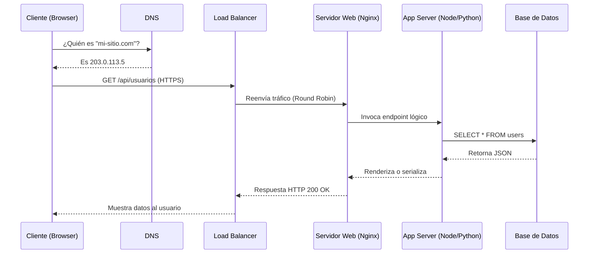

# 1.2 Arquitectura de las aplicaciones web

## Introducción a la Arquitectura de Software

La arquitectura de software no se trata solo de escribir código; se trata de **tomar decisiones estructurales** que definirán la vida útil, escalabilidad y mantenibilidad de un sistema. Como diría Martin Fowler: *"La arquitectura es sobre las cosas importantes. Sea lo que sea eso"*.

En el desarrollo web, la arquitectura dicta cómo fluyen los datos desde la base de datos más profunda hasta la pantalla del usuario, pasando por múltiples capas de lógica, seguridad y red. Una mala arquitectura convertirá cualquier proyecto en una "Gran Bola de Lodo" (Big Ball of Mud) imposible de mantener.

---

## El Modelo Fundamental: Cliente-Servidor Estricto

Aunque hoy hablemos de la nube y el "Edge", todo se reduce al contrato fundamental **Cliente-Servidor**.

### La Anatomía de una Petición
¿Qué pasa cuando escribes `google.com` y das Enter?

1.  **Cliente (Tu Navegador):** Inicia la charla. En la web, el cliente siempre empieza.
2.  **Red (El Camino):** DNS traduce el nombre a números (IP), TCP asegura que los datos lleguen bien.
3.  **Servidor (El Anfitrión):** Un programa (como Apache o Nginx) escucha, procesa y responde.

### Diagrama de Secuencia Detallado (Mermaid)


> **💻 Código en Acción:**
> ¿Cómo funciona realmente un servidor? Hemos creado una simulación en Node.js para que veas las respuestas HTTP.
>
> 📄 **Ver código:** [03_arquitectura_cliente_servidor.js](codigos/03_arquitectura_cliente_servidor.js)
> (Copia, pega y ejecuta con `node 03_arquitectura_cliente_servidor.js`)

---

## Evolución de las Capas (Tiered Architecture)

La historia de la arquitectura web es la historia de la **separación de responsabilidades** (Separation of Concerns).

### Arquitectura Monolítica ("Todo en Uno")
En el pasado, metíamos todo en una sola caja.
*   **Problema:** Si querías cambiar una sola regla (ej. subir el IVA), tenías que actualizar el software en las 500 computadoras de la empresa. Difícil de mantener.

### La Era Dorada: 3-Tier Architecture
Es el estándar de facto para la mayoría de las aplicaciones empresariales tradicionales.

1.  **Capa de Presentación (Presentation Tier):**
    *   *"El Frontend"*. HTML, CSS, JS, Frameworks (React, Vue).
    *   No toma decisiones, solo muestra y captura inputs.
2.  **Capa de Lógica de Negocio (Logic/Application Tier):**
    *   *"El Backend"*. Node.js, Python, Java, C#.
    *   Aquí viven las reglas: "Si el usuario no tiene saldo, rechazar pago", "Calcular envío basado en peso".
3.  **Capa de Datos (Data Tier):**
    *   *"La Persistencia"*. MySQL, PostgreSQL, MongoDB, Redis.
    *   Su único trabajo es guardar y recuperar datos de forma íntegra.

**Ventaja Clave:** Independencia. Puedes cambiar la base de datos de Oracle a MySQL sin tocar una sola línea de código del Frontend.

### Arquitectura N-Tier (Multicapa)
Para sistemas masivos, 3 capas no bastan.
*   **Capa de Caching:** Redis/Memcached antes de la BD para velocidad.
*   **Capa de Integración:** Enterprise Service Bus (ESB) para hablar con sistemas legacy (bancos antiguos).
*   **Capa de Almacenamiento de Objetos:** AWS S3 para fotos/videos, separándolos de la BD transaccional.

---

## Patrones de Diseño Arquitectónico

No confundir con la infraestructura. Esto es cómo organizamos el **código**.

### MVC (Model-View-Controller)
El patrón más famoso, nacido en Smalltalk en los 70s y adoptado por la web (Ruby on Rails, Django, Laravel, Spring MVC).

*   **Model (El Qué):** La verdad de los datos.
    *   *Ejemplo:* Una clase `Product` que sabe guardar su precio en la DB.
*   **View (El Dónde):** La representación visual.
    *   *Ejemplo:* Un archivo `product_detail.html` que espera recibir variables `{{ price }}`.
*   **Controller (El Cómo):** El director de orquesta.
    *   *Flujo:*
        1. Recibe petición `GET /products/5`.
        2. Llama al Modelo: `Product.find(5)`.
        3. Si existe, llama a la Vista: `render('product_detail', data)`.
        4. Si no, devuelve error 404.

#### Ejemplo de Código: MVC en Python (Pseudocódigo Flask)

```python
# --- MODELO ---
class Usuario(db.Model):
    id = db.Column(db.Integer, primary_key=True)
    nombre = db.Column(db.String(80))
    email = db.Column(db.String(120))

    def es_admin(self):
        return self.email.endswith('@empresa.com')

# --- CONTROLADOR ---
@app.route('/perfil/<int:id>')
def ver_perfil(id):
    # 1. El controlador pide datos al Modelo
    usuario = Usuario.query.get(id)
    
    if not usuario:
        return abort(404)
        
    # 2. Lógica de negocio
    permisos = "Total" if usuario.es_admin() else "Limitado"
    
    # 3. El controlador pasa datos a la Vista
    return render_template('perfil_usuario.html', u=usuario, p=permisos)

# --- VISTA (HTML + Jinja2) ---
<!-- perfil_usuario.html -->
<h1>Perfil de {{ u.nombre }}</h1>
<p>Email: {{ u.email }}</p>
<span class="badge">{{ p }}</span>
```

### MVVM (Model-View-ViewModel)
Dominante en el Frontend moderno (Angular, React -aunque React es más V-, Vue).
*   **Problema del MVC clásico:** El controlador engorda mucho ("Massive View Controller").
*   **Solución (Data Binding):** La Vista se actualiza automáticamente cuando cambia el Modelo, gracias al "ViewModel".
*   **Two-Way Data Binding:** Si escribes en un input, se actualiza la variable JS. Si cambias la variable JS, se actualiza el input. Sin código manual de eventos.

---

## De Monolitos a Microservicios

El debate arquitectónico más importante de la última década.

### El Monolito (The Monolith)
Una sola App gigante que hace todo (Login, Ventas, Inventario).
*   **Pros:** Fácil de empezar. Todo el código está junto.
*   **Contras:**
    *   *Efecto Dominó:* Un error en el Chat puede tumbar el sistema de Pagos.
    *   *Pesado:* Para escalar, tienes que duplicar TODO el servidor, no solo la parte lenta.

### Microservicios (Divide y Vencerás)
Romper la App gigante en pequeñas Apps independientes que hablan entre sí.
*   **Filosofía:** "Haz una sola cosa, pero hazla perfecta".
*   **Pros:**
    *   *Escalado Fino:* ¿Mucha gente en el Chat? Levanta 50 servidores de Chat y deja 1 de Pagos.
    *   *Libertad:* Un equipo puede usar Python y otro Node.js.
*   **Contras:**
    *   *Complejidad:* Ahora tienes que cuidar 50 servidores en vez de 1.
    *   *Latencia:* Las partes tienen que hablarse por la red, que es más lenta que la memoria.

### Tabla Comparativa: Monolito vs Microservicios

| Característica | Monolito | Microservicios |
| :--- | :--- | :--- |
| **Despliegue** | Todo o nada. Riesgoso. | Independiente. Bajo riesgo. |
| **Base de Datos** | Compartida y centralizada. | Descentralizada (Database per Service). |
| **Equipo** | Gran equipo trabajando sobre el mismo código. Bloqueos frecuentes. | Equipos pequeños (Squads) dueños de su servicio. |
| **Debug** | Stack trace simple. | "Distributed Tracing" (Sherlock Holmes digital). |
| **Costo Inicial** | Bajo. Ideal para Startups. | Alto. Requiere infraestructura robusta. |

## Arquitectura Serverless y Edge Computing

El término "Serverless" es engañoso. Hay servidores, pero **tú no los administras**.

### FaaS (Function as a Service)
En lugar de tener un servidor Node.js corriendo 24/7 esperando peticiones (y cobrándote dinero aunque nadie entre), subes funciones individuales.
*   **Funcionamiento:**
    1.  Subes una función `procesar_pago()` a AWS Lambda.
    2.  Nadie entra a tu web -> Costo $0.
    3.  Alguien compra -> AWS levanta un contenedor en 100ms, ejecuta tu función, te cobra por los 200ms de ejecución, y destruye el contenedor.

*   **El Problema del "Cold Start":** La primera vez que se ejecuta, tarda un poco más en "despertar" el contenedor.
*   **Casos de Uso:** Procesamiento de imágenes (subes foto -> se crea thumbnail), Webhooks, APIs con tráfico impredecible.

### Edge Computing (Computación en el Borde)
Llevar el código lo más cerca posible del usuario físico.
*   **Cloud Tradicional:** Tu servidor está en Virginia, EEUU. Un usuario en Chile tiene 150ms de latencia.
*   **Edge:** Tu código corre en una red de 300 datacenters alrededor del mundo (Cloudflare Workers, Vercel Edge).
*   **Magia:** Cuando el usuario chileno entra, su petición es atendida por un servidor en Santiago de Chile. Latencia: 5ms.

---

## Cloud Native y los 12 Factores

Para que una aplicación sobreviva en la nube moderna, debe seguir la metodología **The Twelve-Factor App** (creada por Heroku).

1.  **Codebase:** Un solo repositorio controlado por versiones (Git), muchos despliegues.
2.  **Dependencias:** Declararlas explícitamente (package.json, requirements.txt). Nada de "instalar cosas a mano".
3.  **Configuración:** Guardar la configuración (claves, DB URL) en el **Entorno** (Variables de ENV), no en el código.
4.  **Backing Services:** Tratar bases de datos/ficheros como recursos conectables.
5.  **Build, Release, Run:** Separar estrictamente la etapa de construcción de la de ejecución.
6.  **Procesos:** Ejecutar la app como uno o más procesos **sin estado** (stateless).
7.  **Port Binding:** La app debe exportar servicios vía puertos (ej. localhost:5000).
8.  **Concurrencia:** Escalar mediante el modelo de procesos (más copias del proceso, no procesos más grandes).
9.  **Desechabilidad:** Hacer el arranque rápido y el cierre elegante (Graceful Shutdown).
10. **Paridad Dev/Prod:** Mantener desarrollo, staging y producción lo más parecidos posible.
11. **Logs:** Tratar los logs como flujos de eventos (stream a consola), no archivos.
12. **Admin Processes:** Correr tareas de administración/mantenimiento como procesos "one-off".

---

## Infraestructura Crítica de la Web

Más allá del código, la arquitectura web depende de piezas de hardware/software intermedias.

### Balanceadores de Carga (Load Balancers)
El policía de tráfico. Si tienes 3 servidores, el Balanceador distribuye las visitas para que ninguno se sature.
*   **Algoritmos:**
    *   *Round Robin:* Uno para ti, uno para él, uno para aquel.
    *   *Least Connections:* Manda al que tenga menos trabajo ahora.
    *   *IP Hash:* Manda siempre al mismo usuario al mismo servidor (para mantener sesión).

### Proxy Inverso (Reverse Proxy)
Un servidor que se pone "delante" de tu servidor de aplicaciones. El rey indiscutible es **Nginx**.
*   **Funciones:**
    *   **Seguridad:** Oculta la IP real de tu servidor de aplicaciones.
    *   **Terminación SSL:** El proxy descifra el HTTPS y le pasa HTTP plano a tu app (ahorra CPU a tu app).
    *   **Compresión:** Gzip/Brotli automático.

### Caching: El arte de no trabajar
La petición más rápida es la que no se hace.
*   **Regla:** Si ya calculaste algo (como el "Top 10 Ventas"), guárdalo en memoria (Redis). La próxima vez, devuélvelo al instante sin preguntar a la Base de Datos.
*   **Resultado:** Respuestas en milisegundos en lugar de segundos.

---

## Arquitectura Orientada a Servicios (SOA)

Antes de que los microservicios se pusieran de moda (2014), existía SOA (Service Oriented Architecture) en los años 2000. Es importante distinguirlos.

### El Concepto Enterprise (Bus Empresarial)
SOA nació para resolver el caos en las grandes corporaciones (Bancos, Gobierno) que tenían software de 1980 (Mainframes) mezclado con Java y .NET.
*   **Componente Clave: ESB (Enterprise Service Bus).**
    *   Imagina un "Traductor Universal" gigante en el centro de la empresa.
    *   Si el sistema de Recursos Humanos (Java) quiere hablar con el de Nómina (COBOL), manda el mensaje al ESB.
    *   El ESB traduce, transforma y entrega el mensaje.

### SOA vs Microservicios
| Característica | SOA (2000s) | Microservicios (2015+) |
| :--- | :--- | :--- |
| **Coordinación** | Inteligente (ESB). El bus tiene lógica. | Tonta (Smart endpoints, dumb pipes). La lógica está en el servicio. |
| **Protocolo** | SOAP/XML (Pesado). | REST/JSON o gRPC (Ligero). |
| **Datos** | A menudo compartían bases de datos. | Database per Service (Estricto). |
| **Tamaño** | Servicios grandes (ej. "Gestión de Clientes"). | Servicios diminutos (ej. "Validar Email"). |

---

## Arquitectura Peer-to-Peer (P2P) y Descentralizada

No todo es Cliente-Servidor. En P2P, todos son clientes y servidores a la vez.

### BitTorrent y la Web Distribuida
*   **Seeders (Semillas):** Tienen el archivo completo y lo envían.
*   **Leechers (Sanguijuelas):** Están descargando, pero a la vez suben los pedazos que ya tienen a otros leechers.
*   **Swarm (Enjambre):** La red de todos los usuarios compartiendo. Nadie es el dueño central. Si apagas un nodo, la red sigue viva.

### Blockchain y Web3
La arquitectura más resiliente jamás creada.
*   **Ledger Distribuido:** En lugar de que el banco tenga el libro de cuentas (Base de Datos Centralizada), *todos* los usuarios tienen una copia del libro.
*   **Consenso:** Para escribir una nueva línea (transacción), la mayoría (51%) debe estar de acuerdo.
*   **Inmutabilidad:** Una vez escrito, no se puede borrar.

### WebRTC (Real Time Communication)
Permite que dos navegadores hablen directamente (Audio/Video/Datos) sin pasar por el servidor.
*   *Uso:* Google Meet, Zoom (versión web), Discord.
*   *El Servidor:* Solo se usa para el "Handshake" inicial (presentar a las partes), luego se aparta y el video fluye P2P.

---

## Arquitectura PWA (Progressive Web Apps)

El intento de la web por matar a las Apps Nativas (iOS/Android).
Una PWA es una página web que, al instalarse, se comporta como una App.

### Los 3 Pilares Técnicos
1.  **HTTPS:** Requisito obligatorio por seguridad.
2.  **Web App Manifest (`manifest.json`):**
    *   Un archivo JSON que le dice al celular: "Mi nombre es X, mi icono es Y, y quiero abrirme en pantalla completa sin barra de URL".
3.  **Service Workers (El Cerebro):**
    *   Un proxy programable en JS que vive en el navegador.
    *   **Capacidad Offline:** Intercepta todas las peticiones de red. Si no hay internet, devuelve los archivos cacheados.

#### Ejemplo de Service Worker Básico
```javascript
// sw.js - Instalación
self.addEventListener('install', event => {
  event.waitUntil(
    caches.open('mi-app-v1').then(cache => {
      return cache.addAll(['/', '/index.html', '/styles.css', '/app.js']);
    })
  );
});

// Interceptación de red
self.addEventListener('fetch', event => {
  event.respondWith(
    caches.match(event.request).then(response => {
      // Si está en caché, devuélvelo. Si no, ve a internet.
      return response || fetch(event.request);
    })
  );
});
```

---

## Arquitecturas Avanzadas: Más allá de lo básico

### Event-Driven Architecture (EDA)
En microservicios, que el servicio A llame al servicio B (HTTP sincrónico) crea acoplamiento. Si B cae, A falla.
**Solución:** Eventos.
*   **Productor:** "Alguien compró una entrada". (Dispara evento y se olvida).
*   **Consumidor:** El servicio de Email escucha el evento y manda el correo. El servicio de Analytics escucha y actualiza el dashboard.
*   **Ventaja:** Desacoplamiento total y escalabilidad masiva.
*   **Herramientas:** Apache Kafka, RabbitMQ, AWS SNS/SQS.

### Arquitectura Hexagonal (Puertos y Adaptadores)
Inventada por Alistair Cockburn.
*   **Filosofía:** Tu lógica de negocio (Dominio) debe vivir en el centro, aislada del mundo exterior.
*   **Puertos:** Interfaces que definen qué necesita tu app (ej. `IUsuarioRepository`).
*   **Adaptadores:** Implementaciones reales (ej. `SqlUsuarioRepository`, `MockUsuarioRepository`).
*   **Resultado:** Puedes cambiar la Base de Datos de MySQL a Mongo sin tocar una sola línea de tu lógica de negocio. Solo cambias el adaptador.

---

## Laboratorio de Código: Implementando Microservicios

Es fácil dibujar cajas en una pizarra. Vamos a ver cómo se ve la arquitectura de microservicios en código real (Node.js).

Imagina un sistema de E-commerce simplificado. No haremos una aplicación completa, sino dos servicios que hablan por HTTP.

### Servicio 1: Inventario (Puerto 3000)
Este servicio es el "dueño" de los datos de productos. Nadie más puede tocar la BD de productos.
```javascript
// inventory-service.js
const express = require('express');
const app = express();

const products = {
    '101': { name: 'Laptop Gamer', stock: 5 },
    '102': { name: 'Mouse Óptico', stock: 0 } // Agotado
};

app.get('/products/:id', (req, res) => {
    const product = products[req.params.id];
    if (product) {
        res.json(product);
    } else {
        res.status(404).json({ error: 'Producto no encontrado' });
    }
});

app.listen(3000, () => console.log('📦 Servicio de Inventario corriendo en :3000'));
```

### Servicio 2: Órdenes (Puerto 4000)
Este servicio maneja las compras. Para vender, **necesita preguntar** al servicio de inventario si hay stock. No consulta la BD de inventario directamente (eso rompería el patrón).
```javascript
// order-service.js
const express = require('express');
const axios = require('axios'); // Librería para hacer peticiones HTTP
const app = express();

app.post('/buy/:productId', async (req, res) => {
    const pid = req.params.productId;

    try {
        // Llamada Síncrona a otro microservicio (Comunicación Inter-Servicios)
        // En una app real, usaríamos un Service Discovery para no harcodear 'localhost:3000'
        const response = await axios.get(`http://localhost:3000/products/${pid}`);
        const product = response.data;

        if (product.stock > 0) {
            // Lógica compleja de negocio... cobrar tarjeta, etc.
            res.json({ message: `¡Compra exitosa de ${product.name}!` });
        } else {
            res.status(400).json({ error: 'Producto agotado :(' });
        }
    } catch (error) {
        if (error.response && error.response.status === 404) {
            res.status(404).json({ error: 'El producto no existe' });
        } else {
            res.status(500).json({ error: 'Error de comunicación interna' });
        }
    }
});

app.listen(4000, () => console.log('🛒 Servicio de Órdenes corriendo en :4000'));
```

**Análisis del Código:**
1.  **Desacoplamiento:** Si cambiamos la BD de Inventario de una simple variable a MongoDB, el servicio de Órdenes *no se entera* y *no se rompe*. Solo le importa que la API `/products/:id` siga respondiendo JSON.
2.  **Punto de Falla:** Si el servicio de Inventario se cae, el de Órdenes falla (error 500). Para arreglar esto, en arquitectura avanzada usamos **Circuit Breakers**.

---

## Estudios de Caso: Arquitectura a Escala Planetaria

### Caso 1: Netflix (El Campeón de los Microservicios)
Netflix no siempre fue así. En 2008, un error en su base de datos Oracle centralizada tumbó el servicio por 3 días. No podían enviar DVDs.

*   **La Migración:** Decidieron migrar a AWS y romper su monolito Java en microservicios.
*   **El Resultado (2024):**
    *   Tienen más de 1,000 microservicios.
    *   Un servicio solo para manejar el botón de "Play".
    *   Un servicio solo para recordar dónde pausaste la película.
*   **Caos Monkey:** Inventaron una herramienta que apaga servidores aleatoriamente en horario de oficina.
    *   *Filosofía:* "Si nos duele que se apague un servidor, apaguémoslo seguido para obligarnos a diseñar el sistema para que sobreviva".

### Caso 2: Uber (Domando la Complejidad)
Al principio (2011), Uber era un monolito simple en Python.
Con la expansión global (UberEats, UberPool), el monolito era inmanejable.
*   **El Problema:** Para agregar una función a UberEats, tenías que recompilar y desplegar toda la app de Taxis. Riesgo altísimo.
*   **Arquitectura Actual:**
    *   **+4,000 Microservicios:** Escritos en Go, Java, Python y Node.
    *   **Edge Gateway:** Un punto de entrada único que enruta al usuario al servicio correcto.
    *   **Manejo de Geozonas:** Usan una librería llamada H3 (índice espacial hexagonal) para dividir el mundo en celdas y asignar conductores eficientemente.

### Caso 3: Instagram (Escalando el Monolito)
Contrario a la moda, Instagram es famoso por **mantener su Monolito**.
*   **Tecnología:** Python (Django). Sí, Instagram corre sobre Django.
*   **El Truco:** No rompieron el código en microservicios, pero rompieron la Base de Datos.
    *   **Sharding (Fragmentación):** Tienen miles de instancias de PostgreSQL. Tus fotos no están en la misma BD que las de un usuario en Japón.
    *   **Caché Agresivo:** Usan Memcached masivamente. Casi nada toca la DB directamente.
*   **Lección:** No siempre necesitas microservicios para escalar a 1,000 millones de usuarios. A veces, un monolito bien optimizado es mejor (y más barato de mantener).

---

---

## Guía de Decisión Arquitectónica: ¿Qué debo elegir?

Como arquitecto, tu trabajo es decir "Depende". Aquí tienes un árbol de decisión para elegir entre Monolito y Microservicios.

### Scorecard de Complejidad
Suma 1 punto por cada afirmación verdadera.
1.  [ ] ¿Tienes más de 50 desarrolladores trabajando en el Backend?
2.  [ ] ¿Necesitas desplegar varias veces al día sin riesgo de romper todo?
3.  [ ] ¿Tienes partes del sistema que requieren hardware muy distinto (ej. Una requiere GPU para IA, otra requiere mucha RAM para Caché)?
4.  [ ] ¿El negocio está dispuesto a pagar por un equipo de DevOps dedicado (Kubernetes, Monitoring)?
5.  [ ] ¿Los dominios del negocio están claramente separados (ej. Ventas y Logística son departamentos que ni se hablan)?

**Resultados:**
*   **0-2 Puntos:** **Monolito Modular.** Quédate con Django/Laravel/Spring Boot. No te compliques. Usa módulos internos en lugar de servicios de red.
*   **3-5 Puntos:** **Microservicios.** La complejidad del problema justifica la complejidad de la solución.

### El Peligro del "Monolito Distribuido"
El peor error es crear microservicios que *necesitan* hablarse todo el tiempo para funcionar.
*   *Síntoma:* Si para listar usuarios, el Servicio A llama al B, y el B llama al C... has creado un Monolito Distribuido. Tienes todos los problemas de los microservicios (latencia, fallos de red) y ninguna de sus ventajas (independencia).

---

## Estrategias de Renderizado Moderno (Más allá de SSR/CSR)

La dicotomía SSR vs CSR ya es vieja. Hoy tenemos híbridos complejos.

### SSG (Static Site Generation)
El servidor **pre-calcula** todo el HTML en tiempo de compilación (Build Time), no cuando el usuario entra.
*   **Herramientas:** Gatsby, Next.js (modo estático), Hugo, Jekyll.
*   **Ventaja:** Velocidad absurda. El servidor solo entrega archivos HTML simples. Inmune a hackeos de base de datos (porque no hay base de datos conectada en tiempo real).
*   **Desventaja:** Si cambias un precio, tienes que reconstruir y desplegar todo el sitio (tarda minutos). No sirve para datos en tiempo real (ej. Stock de Amazon).

### ISR (Incremental Static Regeneration)
El Santo Grial inventado por **Vercel (Next.js)**. Combina lo mejor de todos los mundos.
*   **Funcionamiento:**
    1.  Generas tus 10,000 productos estáticamente (SSG).
    2.  Le dices a Next.js: "Si alguien pide este producto y han pasado 60 segundos, regeneralo en segundo plano".
    3.  El usuario siempre ve una página estática rápida (cacheada), pero nunca está desactualizada por más de 1 minuto.

### Jamstack (JavaScript, APIs, Markup)
No es una tecnología, es una arquitectura.
*   **Filosofía:** Desacopla el Frontend del Backend completamente.
*   **J** (JavaScript): Toda la lógica dinámica corre en el cliente (Hydration).
*   **A** (APIs): Toda la base de datos se consulta vía APIs (Stripe, Contentful, Firebase).
*   **M** (Markup): HTML pre-renderizado.

---

---

## Patrones de Resiliencia y Teoría Distribuida

Cuando tienes un solo servidor, si se cae, se cae todo. En sistemas distribuidos, las fallas son parciales y constantes. Aquí la teoría se pone seria.

### El Teorema CAP (Brewer's Theorem)
En cualquier sistema distribuido, solo puedes tener **2 de 3** propiedades simultáneamente:
1.  **C**onsistency (Consistencia): Todos los nodos ven los mismos datos al mismo tiempo.
2.  **A**vailability (Disponibilidad): Cada petición recibe respuesta (sin garantía de que sean los datos más recientes).
3.  **P**artition Tolerance (Tolerancia a Particiones): El sistema sigue funcionando aunque se corte el cable de red entre dos nodos.

*   **Desglose:**
    *   **CP (Bancos):** Si se cae la red, prefiero denegar el pago (perder Disponibilidad) a que tengas saldo negativo fantasma (mantener Consistencia).
    *   **AP (Redes Sociales):** Si se cae la red, prefiero mostrarte un like viejo (mantener Disponibilidad) a mostrarte un error 500. La Consistencia llegará después.

### ACID vs BASE
El mundo SQL vs NoSQL.
*   **ACID (Atomicidad, Consistencia, Aislamiento, Durabilidad):**
    *   Transacciones "todo o nada". Exigente y difícil de escalar.
*   **BASE (Basically Available, Soft state, Eventual consistency):**
    *   *Eventual Consistency:* "Al final, todos tendrán el dato correcto". Si le das like a una foto, tu amigo en Japón puede tardar 2 segundos en verlo. No pasa nada.

### Patrón SAGA (Deshacer el pasado)
En Microservicios, no puedes hacer "Rollback" fácil porque cada servicio tiene su propia base de datos.
**Solución:** Si algo falla al final, debes ejecutar una "transacción compensatoria" (un *Undo* manual) en todos los pasos anteriores.
*   Ejemplo: Si falla el envío, el sistema dispara automáticamente un "Reembolsar Dinero" al servicio de Pagos.

### Rate Limiting (Limitación de Velocidad)
Protege tu API de ataques DDoS o usuarios abusivos.
*   **Algoritmo Token Bucket:** Tienes una cubeta con 10 monedas. Cada petición gasta una moneda. Se rellena 1 moneda por segundo. Si no hay monedas, rechazas la petición (HTTP 429 Too Many Requests).

---

## Glosario Técnico de Arquitectura

*   **API Gateway:** Servidor único que actúa como entrada para todos los clientes (móvil, web), enrutando peticiones a los microservicios adecuados.
*   **BFF (Backend for Frontend):** Patrón donde creas un backend específico para el móvil y otro para la web, optimizando los datos para cada pantalla.
*   **Circuit Breaker (Cortacircuitos):** Patrón de diseño que detecta fallos y evita que la aplicación trate de ejecutar una acción condenada al fracaso (ej. si el servicio de pagos está caído, ni siquiera intenta llamarlo, devuelve error inmediato).
*   **Container (Contenedor):** Unidad estándar de software (Docker) que empaqueta el código y sus dependencias para que la aplicación corra rápido y fiable en cualquier entorno.
*   **Daemon:** Proceso informático que se ejecuta en segundo plano, en lugar de estar bajo el control directo de un usuario interactivo.
*   **Event-Driven (Orientado a Eventos):** Arquitectura donde los servicios se comunican emitiendo eventos ("UsuarioRegistrado") en lugar de llamadas directas.
*   **Horizontal Scaling (Escalado Horizontal):** Añadir más máquinas al pool de recursos (más barato, más complejo).
*   **Idempotencia:** Propiedad de una operación que puede ejecutarse varias veces sin cambiar el resultado más allá de la aplicación inicial (ej. Reintentar un pago fallido no debería cobrarte dos veces).
*   **Legacy System:** Software antiguo que sigue siendo crítico para el negocio pero es difícil de mantener o migrar.
*   **Load Balancer:** Dispositivo que actúa como proxy inverso y distribuye el tráfico de red o aplicación entre varios servidores.
*   **Monorepo:** Estrategia donde el código de muchos proyectos (o microservicios) se guarda en un mismo repositorio de Git.
*   **Orquestación:** Gestión automatizada de la configuración, coordinación y gestión de sistemas informáticos y software (ej. Kubernetes).
*   **Vertical Scaling (Escalado Vertical):** Añadir más RAM/CPU a una sola máquina (fácil, pero tiene límite físico).

---

---

## La Última Frontera: Islands Architecture (Arquitectura de Islas)

Mientras SPA (Single Page Applications) dominó el 2015-2020, el problema del peso de JavaScript (JS Bloat) se volvió crítico.
*   **Problema:** Para mostrar un blog estático en React, el usuario descargaba 300KB de JavaScript. Absurdo.

### El Concepto de "Islas"
La web moderna a veces carga demasiado JavaScript innecesario.
**Solución (Astro):** Envía casi todo como HTML estático (rápido) y solo "enciende" (hidrata) el JavaScript en las partes interactivas, como un carrusel de imágenes o un botón de compra. El resto de la página es estática y ligera.

---

## Ejercicios y Retos de Diseño

### Reto 1: Diseñando "Uber Clon"
Eres el arquitecto jefe. Tienes que diseñar el sistema.
1.  **Requerimiento:** El conductor debe ver su posición actual y la del pasajero en tiempo real.
    *   *Pregunta:* ¿Usarías HTTP REST o WebSockets? ¿Por qué?
2.  **Requerimiento:** Si el servicio de "Mapas" falla, la app no debe crashear, solo debe mostrar "Mapa no disponible" pero permitir cancelar el viaje.
    *   *Pregunta:* ¿Qué patrón de microservicios usarías aquí? (Pista: Circuit Breaker).

### Reto 2: Migración Legacy
Tienes una Tienda Online hecha en PHP puro (2008) sin frameworks. Es un caos de código espagueti. El dueño quiere "pasarlo a React".
*   *Estrategia:* No puedes reescribir todo en un mes. Propón una estrategia usando el "Strangler Fig Pattern" (Patrón de la Higuera Estranguladora) para ir migrando pieza por pieza.

---

## Referencias

*   **Libros:** "Clean Architecture" de Robert C. Martin, "Building Microservices" de Sam Newman, "Designing Data-Intensive Applications" de Martin Kleppmann.
*   **Webs:** The Twelve-Factor App Official Site, MartinFowler.com, AWS Whitepapers, Astro Docs.

<div align="center">

[⬅️ Anterior: 1.1 Evolución](1.1.md) &nbsp;&nbsp;|&nbsp;&nbsp; [Siguiente: 1.3 Tecnologías](1.3.md) ➡️

</div>
