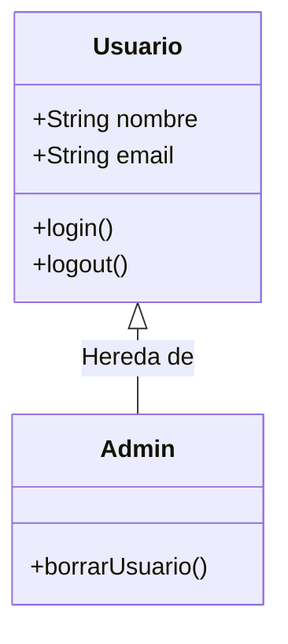

# 1.4 Planificación de aplicaciones web

## Introducción
Escribir código sin planificar es un error.
Una app sin planos es como un edificio sin cimientos: se caerá.
En esta unidad, aprenderemos a crear software profesionalmente, no solo a "picar código".

---

## El Ciclo de Vida del Desarrollo de Software (SDLC)

### El Ciclo de Vida (SDLC)
Pasos para crear software de calidad:
1.  **Análisis (El Qué):** ¿Qué quiere el cliente? (Requisitos).
2.  **Diseño (El Cómo):** Arquitectura y Base de Datos. Planos antes de construir.
3.  **Desarrollo:** Programar.
4.  **Pruebas (QA):** Encontrar errores antes que el usuario.
5.  **Despliegue:** Subir a producción (la nube).
6.  **Mantenimiento:** Arreglar bugs y agregar mejoras.

---

## Metodologías de Desarrollo: El Caos vs El Orden

¿Cómo organizamos a 10 personas para que no se pisen el trabajo?

### Waterfall vs Agile
*   **Waterfall (Cascada):** Estilo antiguo. Terminas todo el diseño antes de programar una línea. Rígido y lento. Usado en construcción o gobierno.
*   **Agile (Ágil):** Estilo moderno (Spotify, Google). Trabajas en ciclos cortos (2 semanas). Entregas algo pequeño pero funcional rápido. Flexible.

### Scrum (El Rey del Ágil)
Framework de trabajo ágil más usado.
*   **Sprints:** Ciclos de 2 semanas. Al final de cada sprint, entregas una nueva "versión" funcional.
*   **Roles:**
    *   *Product Owner:* La voz del cliente.
    *   *Scrum Master:* El entrenador del equipo.
    *   *Dev Team:* Quienes construyen.

### Kanban (Tableros Visuales)
"To Do -> Doing -> Done".
*   Ideal para soporte o tareas continuas.
*   Sin sprints fijos. Solo mueve tarjetas a la derecha.

### Anatomía de un Sprint: Paso a Paso
Un Sprint no es solo "trabajar rápido". Es un ritual sagrado.

**1. Sprint Planning (Lunes 9:00 AM)**
*   *Duración:* 2-4 horas.
*   *Objetivo:* Definir el "Sprint Goal".
*   *Acción:* El equipo jala historias del Backlog hasta llenar su capacidad (ej. 20 puntos).
*   *Resultado:* Un "Sprint Backlog" comprometido.

**2. Daily Scrum (Diario 10:00 AM)**
*   *Duración:* 15 minutos (Timeboxed). Obligatorio de pie.
*   *Preguntas:*
    1.  ¿Qué terminé ayer?
    2.  ¿Qué haré hoy?
    3.  ¿Tengo bloqueo? (Si sí, el Scrum Master toma nota, no se resuelve ahí).

**3. Sprint Review (Viernes 4:00 PM - Fin del Sprint)**
*   *Objetivo:* Demo. Mostrar *software funcionando* al cliente. nada de PowerPoints.
*   *Feedback:* El cliente dice "Me gusta, pero cambia el color". Se anota para el siguiente Sprint.

**4. Sprint Retrospective (Viernes 5:00 PM)**
*   *Privacidad:* Solo el equipo técnico (sin jefes ni clientes).
*   *Dinámica:* "Start, Stop, Continue".
    *   *Start:* ¿Qué deberíamos empezar a hacer? (ej. Code Reviews más estrictos).
    *   *Stop:* ¿Qué dejamos de hacer? (ej. Reuniones de 3 horas).
    *   *Continue:* ¿Qué hicimos bien? (ej. La pizza del jueves).

---

## Herramientas de Gestión de Proyectos

No uses Excel. Por favor.

### Jira (El Estándar Corporativo)
Poderoso, complejo, caro.
*   Permite control total de Sprints, Burndown Charts (gráficas de velocidad), reportes de bugs.
*   Se integra con GitHub y Slack.

### Trello (La Simplicidad)
Tableros Kanban puros.
*   Ideal para equipos pequeños o proyectos personales.
*   Drag & Drop intuitivo.

### Notion (El Todo-en-Uno)
Documentación + Tareas + Wiki.
*   Muy popular en Startups modernas. Flexibilidad total.

### GitHub Projects
Gestión de proyectos integrada en el mismo lugar donde vive el código.
*   Cada "Issue" se convierte en una tarjeta. Si cierras el Issue con un commit, la tarjeta se mueve sola a "Done".

### La Guerra de las Herramientas: Tabla Comparativa

| Característica | Jira | Trello | Notion | GitHub Projects |
| :--- | :--- | :--- | :--- | :--- |
| **Curva de Aprendizaje** | Alta (Difícil) | Baja (Muy Fácil) | Media | Media |
| **Precio** | Caro ($$) | Freemium | Freemium | Gratis (si usas GitHub) |
| **Personalización** | Total (Workflows complejos) | Limitada (Solo columnas) | Infinita (Es un LEGO) | Alta (Integrada con código) |
| **Ideal para...** | Empresas grandes, Agile estricto. | Proyectos personales, equipos pequeños. | Wikis, Startups, Documentación. | Desarrolladores Open Source. |
| **Lo malo** | Lento. Odiado por desarrolladores. | Se queda corto en proyectos grandes. | Puede volverse desordenado. | Menos funciones visuales. |

---

## Historias de Usuario: El Lenguaje del Negocio

En Waterfall usábamos documentos de 500 páginas llamados "Especificación de Requisitos de Software" (SRS). Nadie los leía.
En Agile usamos **Historias de Usuario**.

### Estructura Estándar
> "Como **[Rol]**, quiero **[Acción]**, para **[Beneficio]**."

*   *Mal:* "El sistema debe tener un botón azul para login." (Eso es diseño, no requerimiento).
*   *Bien:* "Como **Cliente**, quiero **iniciar sesión con mi huella digital**, para **acceder rápido sin recordar contraseñas**."

### Criterios de Aceptación (Acceptance Criteria)
La letra chica del contrato. Definen cuándo la historia está "Hecha" (Definition of Done).
Para la historia de Login con Huella:
1.  Si el dispositivo no tiene lector, ocultar la opción.
2.  Si falla 3 veces, pedir PIN.
3.  Funciona en iOS y Android.

### Criterio INVEST
Una buena historia debe ser:
*   **I**ndependent (Independiente): Se puede desarrollar sin esperar a otra.
*   **N**egotiable (Negociable): No es un contrato cerrado, se discute.
*   **V**aluable (Valiosa): Aporta valor al usuario.
*   **E**stimable (Estimable): El equipo sabe cuánto tardará.
*   **S**mall (Pequeña): Cabe en un Sprint.
*   **T**estable (Probable): Se puede verificar.

---

## Técnicas de Estimación: El Arte de la Adivinación

### Estimación (El Arte de la Adivinación)
Los humanos somos pésimos estimando tiempo.
*   **Consejo:** No digas "Mañana queda". Di "Entre 2 y 3 días".
*   **Story Points:** En lugar de horas, asigna puntos de dificultad (1=Fácil, 8=Difícil). Es más preciso a largo plazo.

---

## Modelado y Diagramación (UML Moderno)

Antes de tirar código, dibuja. Una imagen vale más que 1000 líneas.

### UML (Unified Modeling Language)
Aunque hoy somos menos estrictos, estos diagramas siguen siendo vitales:

#### A. Diagrama de Clases (Estructura Estática)
Para POO (Programación Orientada a Objetos).


#### B. Diagrama de Secuencia (Interacción Dinámica)
Para ver cómo fluyen los datos en una API.
(Ver ejemplo en la Unidad 1.2).

#### C. Diagrama de Entidad-Relación (DER)
Para Bases de Datos.
*   Usuario --(1:N)--> Pedidos
*   Pedidos --(N:M)--> Productos

### C4 Model (Arquitectura de Software)
Más moderno que UML. Divide el sistema en 4 niveles de zoom:
1.  **Contexto:** La caja negra. "Sistema de Banca".
2.  **Contenedores:** Apps Web, API, DB.
3.  **Componentes:** Controladores, Servicios dentro de la API.
4.  **Código:** Clases y funciones.

---

## Diseño UI/UX: Más allá de "Que se vea bonito"

El diseño no es arte, es resolución de problemas.

### El Proceso de Diseño
1.  **User Personas:** Define a tu usuario.
    *   *Ejemplo:* "María, 45, contadora, usa lentes, poco tecnológica". → *Diseño:* Letra grande, contrastes altos, flujos simples.
2.  **User Journey Map:** El camino del héroe.
    *   María entra -> Busca factura -> No la encuentra -> Se frustra -> Llama a soporte. (Aquí hay una oportunidad de mejora).
3.  **Design System (Sistema de Diseño):**
    *   No inventes un botón nuevo cada vez. Crea una biblioteca de componentes (Botones, Inputs, Colores) para mantener consistencia.
    *   *Herramientas:* Atomic Design.

### Niveles de Fidelidad
*   **Low-Fi (Papel):** Para validar ideas rápido. Si tiras un diseño en papel a la basura, perdiste 5 minutos.
*   **Mid-Fi (Wireframes):** Estructura y flujo. Sin distracciones de color.
*   **Hi-Fi (Mockups):** Pixel Perfect. Así se verá realmente.

---

## Documentación Técnica: El Mapa del Tesoro

"El código le dice a la máquina qué hacer. La documentación le dice al humano por qué".

### PRD (Product Requirements Document)
El documento maestro. Contiene:
*   Objetivo del negocio.
*   Alcance (In/Out).
*   User Stories.
*   Métricas de éxito (KPIs).

### Documentación de API (Swagger / OpenAPI)
Si haces Backend, tu "producto" es la API.
*   Swagger autogenera una web donde el Frontend puede probar tus endpoints sin que tú escribas HTML.
*   Contrato sagrado: "Si me mandas X, te respondo Y".

### Onboarding Docs
¿Cuánto tarda un programador nuevo en correr el proyecto?
*   *Malo:* 3 días configurando variables de entorno.
*   *Bueno:* 10 minutos (gracias a un buen `README.md` y Docker).

---

### Estrategia de Producto
*   **MVP (Producto Mínimo Viable):** La versión más pequeña que puedes vender.
    *   *Ejemplo:* Uber empezó siendo un grupo de WhatsApp de choferes. Sin app, sin mapa. Solo el servicio.
    *   *Objetivo:* Aprender si la gente quiere tu producto antes de gastar millones.

---

## Gestión de Riesgos y Legalidad

Lo que nadie planea y luego te explota en la cara.

### Riesgos Técnicos
*   **Deuda Técnica:** "Lo hacemos rápido y mal ahora, lo arreglamos luego". (Spoiler: Nunca lo arreglas).
*   **Bus Factor:** ¿Si a Juan lo atropella un autobús, el proyecto muere? Si la respuesta es sí, tienes un Bus Factor de 1. ¡Peligro! Documenta todo.

### Legalidad (Compliance)
*   **GDPR (Europa) / Ley de Protección de Datos (México):**
    *   Debes pedir permiso para usar cookies.
    *   El usuario tiene "Derecho al Olvido" (borrar todos sus datos).
*   **Accesibilidad (WCAG):**
    *   Si tu web estatal no es accesible para ciegos, te pueden demandar.

### La Matriz de Riesgos (Risk Matrix)
No digas "hay riesgos". Clasifícalos para saber cuáles ignorar y cuáles atacar.

| Riesgo | Probabilidad (1-5) | Impacto (1-5) | Severidad (PxI) | Mitigación |
| :--- | :--- | :--- | :--- | :--- |
| **"El servidor se cae"** | 2 | 5 | 10 (Alta) | Usar balanceador de carga y redundancia. |
| **"Cambian la API de Google"** | 3 | 4 | 12 (Alta) | Crear una capa de abstracción (Adapter Pattern). |
| **"Enfermedad de un Dev"** | 3 | 3 | 9 (Media) | Documentación y Pair Programming. |
| **"Al cliente no le gusta el color"** | 4 | 1 | 4 (Baja) | Prototipos aprobados antes de codificar. |

*   **Riesgos Catastróficos (Severidad > 20):** Si ocurren, el proyecto se cancela. (Ej. Se acaba el presupuesto, Problemas legales graves).

---

## El Factor Humano (Soft Skills)

Puedes ser el mejor programador del mundo, pero si no sabes trabajar con humanos, fracasarás.

### Comunicación Asertiva
*   **Saber decir NO:** El cliente siempre pedirá "una cosa más". Si dices sí a todo, el proyecto se retrasará. Aprende a decir: "Sí podemos hacerlo, pero tendremos que sacar otra cosa del Sprint para mantener la fecha".
*   **Evitar el "Tecnoñol":** No le digas al cliente "La tabla de la DB no tiene índices". Dile "El sistema está lento porque tiene mucha información desordenada".

### Gestión del Tiempo y Burnout
*   **Ley de Parkinson:** "El trabajo se expande hasta llenar el tiempo disponible". Si te das 1 semana para algo que toma 2 horas, tardarás 1 semana.
*   **Síndrome del Impostor:** Sentir que no sabes nada. Es normal. En tecnología nadie lo sabe todo.

### Gestión de Stakeholders (Los Interesados)
No todos los interesados son iguales. Usa la **Matriz de Poder/Interés**:

1.  **Alto Poder / Alto Interés (Gestionar Atentamente):** El Cliente que paga, el Director de Tecnología. Mantenlos informados diariamente.
2.  **Alto Poder / Bajo Interés (Mantener Satisfechos):** El CEO de la empresa cliente. No le importa el detalle, solo que "funcione".
3.  **Bajo Poder / Alto Interés (Mantener Informados):** Los usuarios finales beta testers. Aman el producto pero no deciden el presupuesto.
4.  **Bajo Poder / Bajo Interés (Monitorear):** Personal de otras áreas. No gastes energía aquí.

---

## Caso de Estudio Completo: "Tinder para Adoptar Perros"

Vamos a aplicar TODO lo aprendido en un proyecto ficticio: **"DogMatch"**.

### Paso 1: Visión y Alcance
*   *Cliente:* Refugio de animales local.
*   *Problema:* Tienen muchos perros y poca gente va al refugio físico.
*   *Solución:* Una App donde veas fotos y hagas "Match".

### Paso 2: User Personas
1.  **Ana (Adoptante):** 30 años, vive sola, quiere compañia. Usa Instagram todo el día.
2.  **Pedro (Voluntario):** 50 años, cuida el refugio. No sabe usar computadoras. Necesita algo SÚPER simple para subir fotos.

### Paso 3: User Stories (Backlog)
Priorizadas por valor de negocio (MoSCoW):

| Prioridad | Rol | Historia | Story Points |
| :--- | :--- | :--- | :--- |
| **Must Have** | Ana | Ver fotos de perros cercanos | 5 |
| **Must Have** | Pedro | Subir foto y nombre del perro | 3 |
| **Must Have** | Ana | Contactar al refugio (botón WhatsApp) | 2 |
| **Should Have** | Ana | Filtrar por raza/tamaño | 5 |
| **Could Have** | Ana | Donar dinero por PayPal | 8 |
| **Won't Have** | Ana | Video llamadas con el perro | 13 |

### Paso 4: Estimación y Roadmap
*   *Velocidad del Equipo:* 20 Puntos por Sprint.
*   *Sprint 1 (MVP):* Todo el "Must Have" (10 Puntos). Sobra tiempo para pruebas.
*   *Sprint 2:* Filtros + Login de usuarios.

### Paso 5: Wireframes (Low-Fi)
(Aquí iría un dibujo en servilleta).
*   Pantalla 1: Login gigante.
*   Pantalla 2: Tarjeta del perro (Foto grande, Nombre, Edad). Botones X y Corazón.

### Paso 6: Riesgos
*   *Legal:* ¿Qué pasa si un perro adoptado muerde a alguien? (Disclaimer legal en la app).
*   *Técnico:* ¿Dónde guardamos las fotos? (Servicio S3 de AWS, cuesta dinero).

---

## Plantillas de Documentación (Copiar y Pegar)

No inventes la rueda. Usa estas plantillas.

### Plantilla de Historia de Usuario
```markdown
## Título: [Nombre Corto, ej. Login con Google]
**ID:** US-101 | **Prioridad:** Alta | **Estimación:** 3 pts

**Como:** [Usuario Nuevo]
**Quiero:** [Registrarme con mi cuenta de Google]
**Para:** [No tener que llenar el formulario de registro]

**Criterios de Aceptación:**
- [ ] Debe aparecer el botón "Sign in with Google".
- [ ] Si el correo ya existe, debe vincular la cuenta.
- [ ] Si falla la API de Google, mostrar error amigable "Intenta más tarde".
```

### Plantilla de Reporte de Bug
```markdown
## Título: [Descripción breve del fallo]
**ID:** BUG-205 | **Severidad:** Crítica (Bloqueante)
**Entorno:** Producción / iPhone 13 (Safari)

**Pasos para reproducir:**
1. Ir a la pantalla de "Checkout".
2. Agregar un producto al carrito.
3. Dar clic en "Pagar con PayPal".

**Resultado Esperado:**
Redirigir a PayPal.com.

**Resultado Actual:**
La pantalla se pone blanca y la app se cierra.

**Logs/Screenshots:**
(Adjuntar imagen aquí).
```

---

## Ejercicios Prácticos del Mundo Real (Nivel Senior)

### Reto 1: "El Cliente Indeciso"
**Contexto:**
El cliente te pide: *"Quiero una plataforma tipo Uber pero para pasear gatos. Y quiero que tenga Blockchain."*
**Tu Misión:**
1.  Escribe 3 preguntas clave para "bajar a tierra" al cliente (Análisis de Requisitos).
2.  Identifica por qué "Blockchain" es probablemente un requerimiento innecesario.
3.  Define el MVP (Producto Mínimo Viable). ¿Qué es lo mínimo que necesitas para probar si la gente quiere pasear gatos? (Pista: No es una App, quizás es una Landing Page).

### Reto 2: "Planning Poker Simulation"
Tienes las siguientes historias. Asigna Story Points usando Fibonacci (1, 2, 3, 5, 8, 13).
1.  *Cambiar el logo del footer.* (Complejidad: Mínima).
2.  *Crear un chat en tiempo real entre conductor y pasajero.* (Complejidad: Alta, Incertidumbre: Media).
3.  *Integrar Login con Facebook.* (Complejidad: Media, ya lo has hecho antes).
4.  *Crear un algoritmo de recomendación basado en IA que prediga qué pizza quiere el usuario.* (Complejidad: Extrema, Incertidumbre: Total).

### Reto 3: "Diagramando el Caos"
Dibuja (en papel o Mermaid) el diagrama de flujo para "Pedir una Pizza".
*   Inicio -> Usuario elige Pizza -> ¿Está logueado?
    *   No -> Login -> Volver a pedir.
    *   Sí -> Formulario de Dirección -> Pagar -> Fin.
*   ¿Qué pasa si falla el pago? ¿A dónde regresa el flujo?

---

## Glosario Técnico de Planificación

*   **Backlog:** La lista de "todo lo que hay que hacer". Nunca termina.
*   **Blocker (Bloqueo):** Algo que impide trabajar. "No puedo probar porque el servidor está caído". Se reporta en el Daily.
*   **Burnout:** Agotamiento físico y mental por estrés crónico. Enemigo #1 del programador.
*   **Burndown Chart:** Gráfico que muestra cuánto trabajo falta vs tiempo restante. Si la línea no baja, estamos en problemas.
*   **Crunch:** Trabajar horas extra obligatorias (fines de semana) para cumplir una fecha imposible. Señal de mala planificación.
*   **Deadline:** Fecha límite.
*   **Definition of Done (DoD):** Lista de requisitos para decir que algo está terminado (ej. "Código escrito + Tests pasaron + Aprobado por QA").
*   **Epic (Épica):** Una historia de usuario muy grande que no cabe en un Sprint. Se debe romper en historias más pequeñas.
*   **Feature Creep (Alcance no controlado):** Cuando el proyecto sigue creciendo sin fin porque se agregan "pequeñas cosas" constantemente.
*   **KPI (Key Performance Indicator):** Métrica para medir éxito (ej. "Usuarios registrados por semana").
*   **Refactoring:** Mejorar el código sin cambiar lo que hace. Es mantenimiento necesario.
*   **Scope (Alcance):** Lo que SÍ vamos a hacer. Todo lo que esté fuera del Scope, no se hace.
*   **SLA (Service Level Agreement):** Contrato que garantiza un nivel de servicio (ej. "99.9% de Uptime").
*   **Spike:** Una tarea de investigación. "Dedicar 4 horas a investigar qué pasarela de pagos es mejor". No entrega código, entrega conocimiento.
*   **Stakeholder:** Cualquier persona interesada en el proyecto (Jefe, Cliente, Inversor).
*   **Technical Debt (Deuda Técnica):** El costo futuro de elegir una solución rápida y sucia hoy en lugar de una mejor pero más lenta.

---

## Referencias y Bibliografía

*   **Libros:**
    *   *"The Lean Startup"* de Eric Ries (Biblia del MVP).
    *   *"Scrum: The Art of Doing Twice the Work in Half the Time"* de Jeff Sutherland.
    *   *"User Story Mapping"* de Jeff Patton.
    *   *"Don't Make Me Think"* de Steve Krug (Usabilidad).
*   **Recursos Web:**
    *   [Agile Manifesto](https://agilemanifesto.org/): Donde empezó todo.
    *   [Atlassian Agile Guide](https://www.atlassian.com/agile): Guía completa de Jira/Scrum.
    *   [Mountain Goat Software](https://www.mountaingoatsoftware.com/): Blog de Mike Cohn sobre User Stories.

<div align="center">

[⬅️ Anterior: 1.3 Tecnologías](1.3.md) &nbsp;&nbsp;|&nbsp;&nbsp; [Siguiente Unidad: HTML, XML y CSS](../unidad2/README.md) ➡️

</div>
